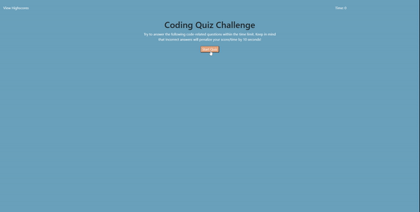

# Web APIs: Timed Code Quiz

Users are able to take a timed coding assesment with multiple-choice questions that reveals if the options they choose is correct or not. 

## Quiz contains:
```
- 5 questions 
- 75 "second" timer
- Highscores Page
```

## Quiz difficulties
```
- the timer doesn't actually decrease by a "second", the timer decreases by half a second
- if the user gueses incorrectly, the time will decrease by 10 "seconds" HOWEVER if the uses guesses correctly the time increases by 5 "seconds"
```

## Mock-Example vs. Actual

#### Mock-Example


#### Actual



### URL of Depoloyed Application

:point_right:  [oliva-sam.github.io/bootcamp/homework4](https://oliva-sam.github.io/bootcamp-homework4/)  :point_left:

